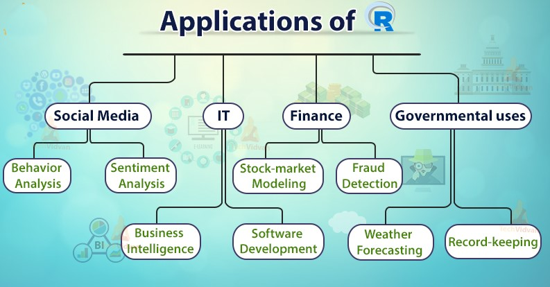
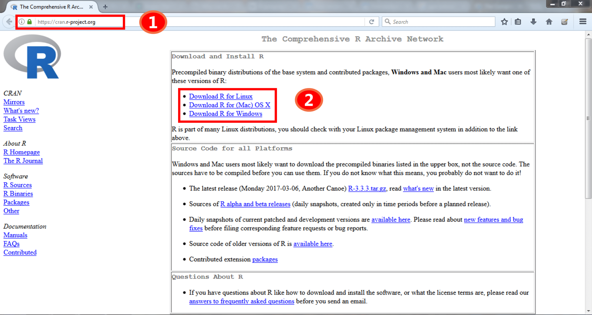
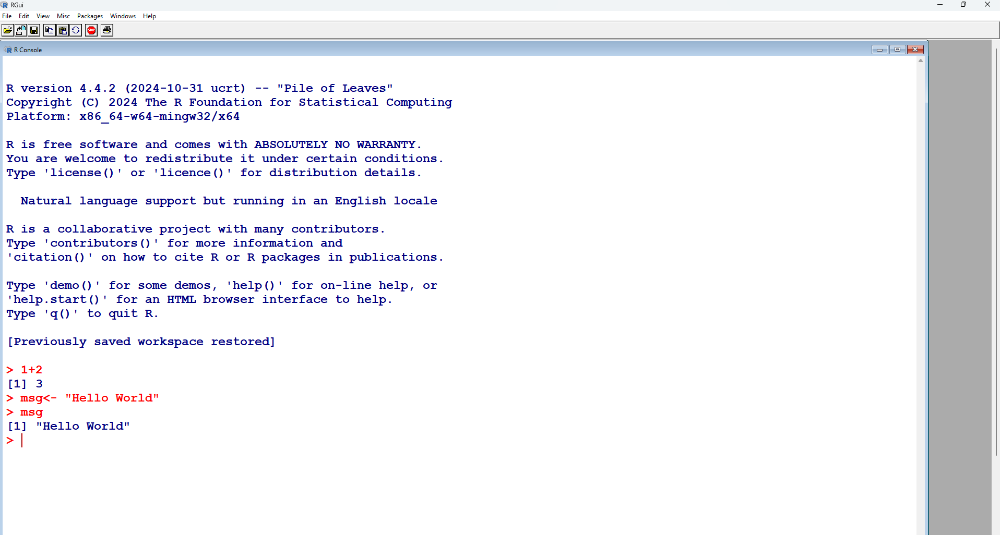
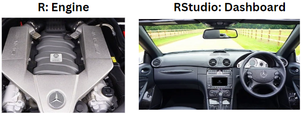
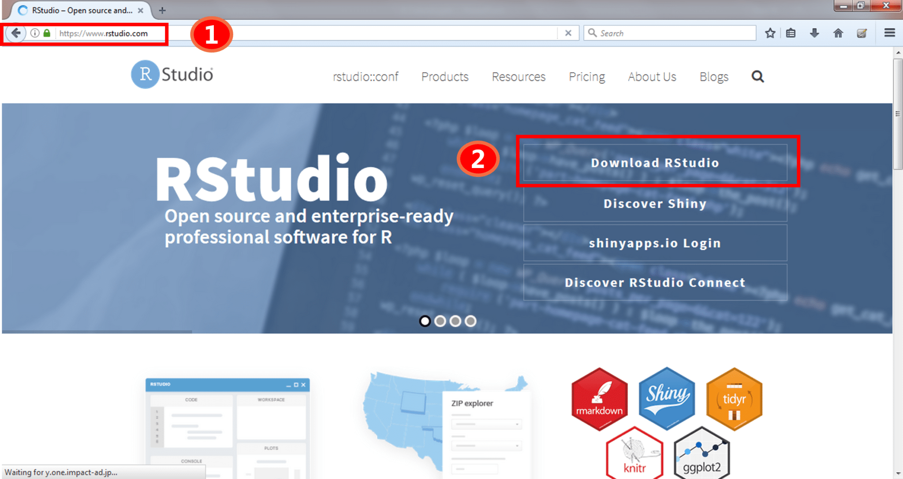
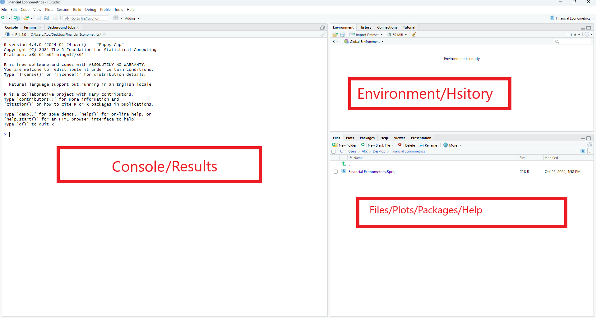
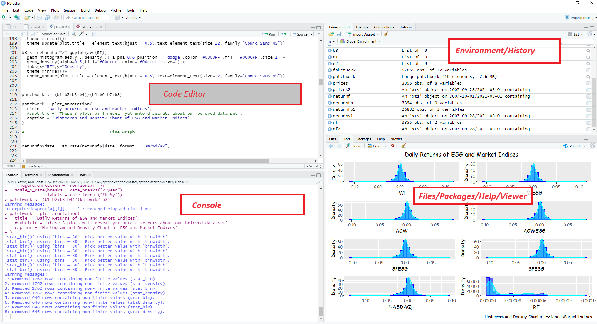

## Welocme

<br/>

::: incremental
-   Intro :wave:
-   Welcome :chart_with_upwards_trend:
-   Installation :wrench:
-   Help :ambulance:
-   Sir ! :eyes:
:::

------------------------------------------------------------------------

## Introduction 

::: incremental
-   Class: Twice a Week
-   Practice: Daily
-   Bring your :computer:
-   Course material on [https://intro2ramu.netlify.app/](https://intro2ramu.netlify.app/)
:::

## What is R? & Why?

**Evolution of R Programming**

::: incremental
-   `R` is a powerful tool for statistical computing and graphics, widely used in academia and industry for data analysis, statistical modeling, and visualization.
-   R language developed by Ross Ihaka and Robert Gentleman in 1990
-   R shows its first appearance in the year 1993
-   R language along with the software, developed by the group of people known as \`R Core Team.'
-   For more details click [HERE](https://bookdown.org/rdpeng/rprogdatascience/history-and-overview-of-r.html)
:::

## What is R? & Why?

**Advantages of R programming**

::: incremental
-   Open Source
    -   Open source software system. It is freely available
    -   NO FREE LUNCH?
-   Cross-Platform Compatibility
-   Advance Statistical Language
-   Outstanding Graphics
:::

## What is R? & Why?

**Advantages of R programming II**

::: incremental
-   Flexible and Fun
    -   R is very flexible to work with it. It has a very user-friendly interface.
-   Extremely Comprehensive
    -   R offers powerful packages for statistical analysis, enabling complex data operations and professional-level analytics.
:::

## What is R? & Why?

**Advantages of R programming III**

::: incremental
-   Supports Extensions
    -   To provide advanced features R extended with multiple extensions. The r core team is developing R and extended the R by adding new Packages to it.
-   Vast Community
    -   R has a broad community of online users. As the popularity of R increases, the energetic, vibrant users clubbed with this community.
-   Integration with other languages
    -   R integrates well with other programming languages like C++, Java, and Python, enhancing its functionality and flexibility.
:::

## What is R? & Why?

**Applications of R Programming**

{fig-align="center"}

## What is R? & Why?

**Applications of R programming II**

::: incremental
-   Finance
    -   **JP Morgan**: Uses R for risk analysis and predictive analytics.
    -   Example: Assessing credit risk based on customer data using logistic regression models.
-   Healthcare
    -   **Pfizer**: Utilizes R for drug discovery and clinical trial data analysis.
    -   Example: Analyzing patient response data to determine drug efficacy.
-   E-Commerce
    -   **Amazon**: Implements R for customer purchasing patterns and recommendation systems.
    -   Example: Using clustering algorithms to segment customers and personalize marketing strategies.
-   Sports Analytics
    -   **ESPN**: Applies R to analyze player performance and game statistics to enhance broadcasting insights.
    -   Example: Predictive modeling of player injuries and performance trends.
-   Academia
    -   Universities and research institutions globally use R for statistical research, teaching, and data analysis.
    -   Example: Econometric analysis of economic trends and policy impacts.
-   Technology
    -   **Google**: Employs R for advertising effectiveness and algorithm refinement.
    -   Example: Analyzing user interaction data to optimize ad placement and content.
:::

## Learning R

:::: center
::: incremental
-   Learning by doing
-   At the beginning it's hard, but later it pays off
:::
::::

## Learning R {background-video="intro-vid3.mp4" background-video-loop="true" background-video-muted="false"}

::: incremental
-   Learning by doing
-   At the beginning it's hard, but later it pays off
:::

## What can be done using R?



## Who can learn?



# Let's Start {background-image="images/installation.png"}

## Let's Start

**Installation**

::: incremental
-   STEP1: Go to the website <https://cran.r-project.org/>
-   STEP2 : Download and install R on your system.
:::

{fig-align="center"}

## Let's Start

```         
Plain R user interface with some text entered 
```

{.r-stretch fig-align="center"}

## Let's Start

R-Studio

{.r-stretch}

## Let's Start

You can work directly in R, but a graphical interface is more convenient. One of most popular/useful is RStudio, an integrated development environment (IDE)

::: incremental
-   a console

-   a powerful code/script editor featuring

-   

    ```         
    special tools for plotting, viewing R objects and code history
    ```

-   cheatsheets for R programming

-   tab-completion for object names and function arguments
:::

## Installation of R-studio

::: incremental
-   STEP1: Go to the website <https://posit.co/>
-   STEP2: Download and install Rstudio on your system
:::

{.r-stretch}

## Lets Start

R-studio Overview

{.r-stretch}

## Lets Start

R-studio Overview

{.r-stretch}

## Gettin help- Inside R

:::incremental
- `help("apply")` # get help for the function</span>
- `?apply` <span style="color: green;"># The same. saves typing effort.</span>
- Press F1 while the cursor is at a command. 
- `?read.table` 
- <span style="color: blue;">help.search</span>("data input")<span style="color: green;"># search by specific subject</span>
- <span style="color: blue;">find</span>("package name")<span style="color: green;"># Tells about the package</span>
- <span style="color: blue;">help.start()</span> <span style="color: green;"># html help Manuals, Material, search engine</span>
:::

## Getting Help-Outside R

- [R-Manuals](https://cran.r-project.org/manuals.html) for introduction to the language
- Ref Cards: [base](https://posit.cloud/learn/cheat-sheets) and [advanced](https://rstudio.com/wp-content/uploads/2016/02/advancedR.pdf) cheatsheets from [Rstudio](https://rstudio.com/resources/cheatsheets/)
- [StackOverflow](https://stackoverflow.com/) for programming questions <span style="background-color: red; color: white;">main resource</span>


## Books and Online Resources

- Grolemund & Wickham (2017) **R for Data Science**
- [Using R for Introductory Econometrics by Florian Heiss](http://urfie.net/)
- [R Tutorials](https://data-flair.training/blogs/r-tutorials-home/)
- [Need Motivation! Click HERE](https://data-flair.training/blogs/r-programming-language/)


------------------------------------------------------------------------

## Last Message {background-color="#B22222"}

<br> <br>

. . .

::: r-stack
Questions?
:::

<br> <br>

. . .

::: r-stack
THANKS
:::

<br> <br>

. . .

::: r-stack
:runner:
:::
