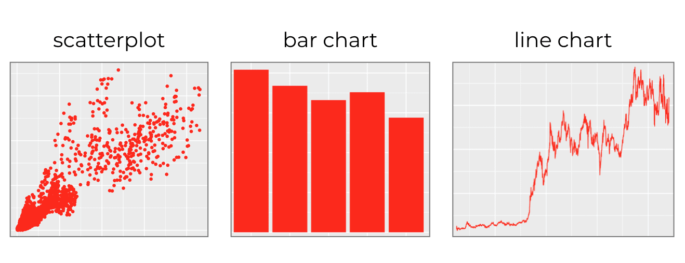
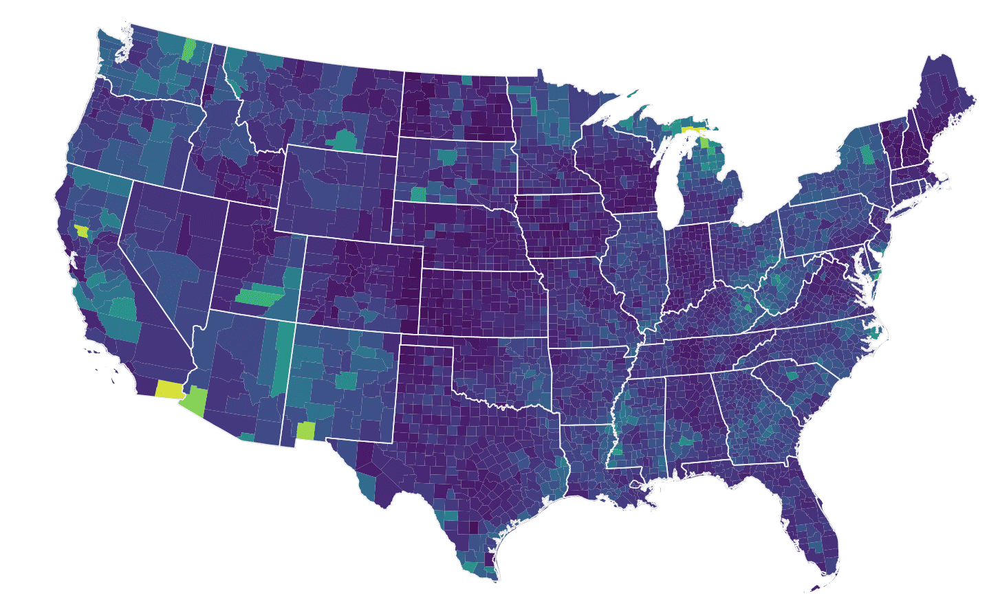
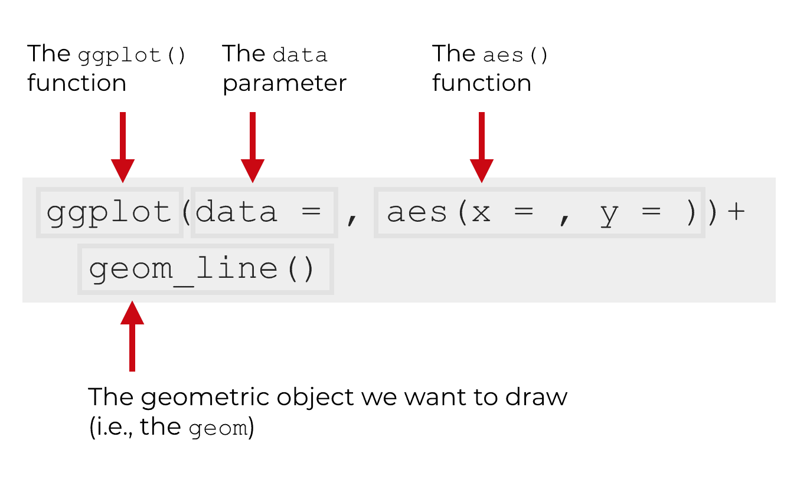
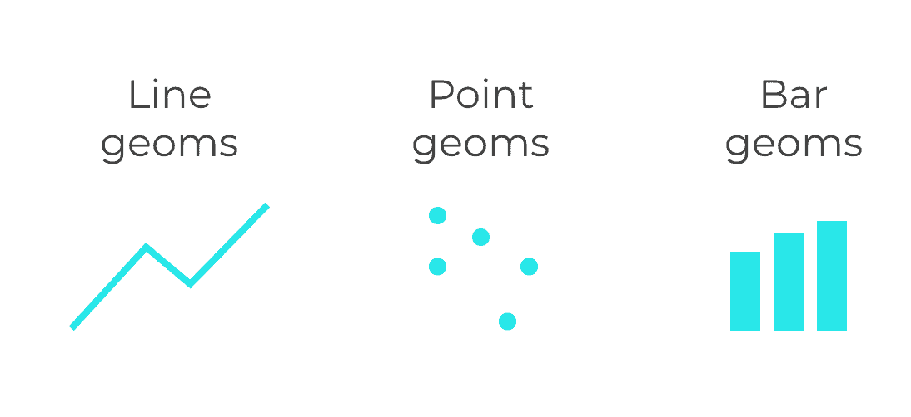
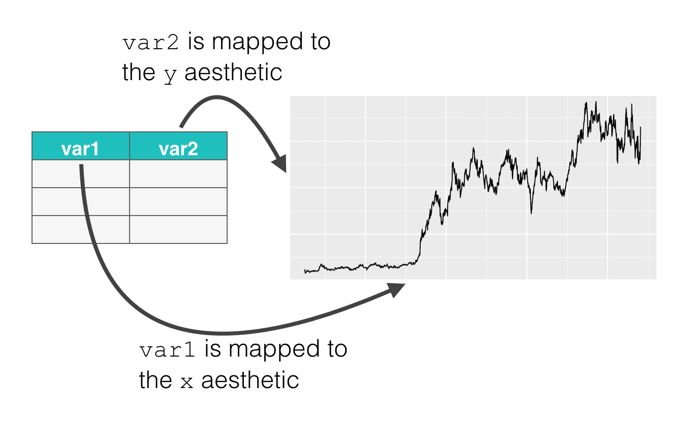

```{r packages, include = F, eval = T}
hook_source <- knitr::knit_hooks$get('source')
knitr::knit_hooks$set(source = function(x, options) {
  x <- stringr::str_replace(x, "^[[:blank:]]?([^*].+?)[[:blank:]]*#<<[[:blank:]]*$", "*\\1")
  hook_source(x, options)
})

library(tidyverse)
library(skimr)
library(janitor)
library(DT)
library(here)
library(kableExtra)
library(knitr)
library(titanic)

```
```{css, echo=F}
.code-bg-red .remark-code, .code-bg-red .remark-code * {
 background-color:red!important;
}
```


---

class: inverse, center, middle

background-image: url("images/ggplot2.png")
background-size: cover
# .red[GGPLOT2]

---

# INTRODUCTION

--

## `ggplot2`:- a **package** for data visualization 

--

.pull-left[

## Simple


.center[]
]


--

.pull-right[

## Complicated

.center[]

]

--

##  **ggplot2** is the most popular data visualisation R package

---


# INTRODUCTION
 
--

- Core function:- `ggplot()`

--

  - `gg` refers **grammar of graphics** 

--

- `ggplot2` is highly modular 

--

  - ONE function for ONE work 
--

  - almost every little operation that you want to perform has a separate function
  
--

  - like little Lego building blocks that you can snap together


---

# .red[INTRODUCTION]


--

- `gglpot2` follows layered approach

--

-  **Layers** and **design elements** are added on top of one another

--

- Each command for a **Layer** is added to the previous ones with a plus symbol `(+)` 

--

- At the end, we have a multi-layer plot object that can be saved, modified, printed, exported, etc.

---


# .red[?Help]

--

## Data visualization cheat sheet from ~`R Studio`

--

##  [A Layered grammar of graphics by Hadley Wickham](https://vita.had.co.nz/papers/layered-grammar.html)

--

## [The BOOK](https://ggplot2-book.org/mastery.html)

--

## [Another source](https://clauswilke.com/dataviz/references.html)

--

## [The Package](https://www.rdocumentation.org/packages/econocharts/versions/1.0)


---

class: center, middle

# .green[Basics]

--

## THE GGPLOT2 OPERATES ON `DATAFRAMES`

--

## THE BASICS OF GGPLOT SYNTAX

--

.center[]

---
# THE SYNTAX

--

## The `ggplot()` function

--

## The ggplot() function is the core function of ggplot2

--

## Everything else in the ggplot2 system is built “on top of” this function.

--

.pull-left[

```{r,eval=FALSE}
ggplot() #<<
```

--
## Creates a plot area/canvas upon which layers are added

## Ends with `+`
]

--

.pull-right[

```{r,echo=FALSE,fig.align='center', fig.width= 5,fig.height=5}
ggplot()
```

]

---
# THE SYNTAX

--

## The DATA parameter 

--

## Inside of the the `ggplot()` function, the first parameter is the `data` parameter

--

## The data parameter essentially specifies the `data` that we want to .red[visualize]

--

## .red[Alert]: `ggplot2` works with `data.frame` ONLY


---
# THE SYNTAX

--

## The DATA parameter 

.pull-left[

```{r,eval=FALSE}
ggplot(data=iris) #<<
```
]

--

.pull-right[

output
```{r,echo=FALSE}
iris %>% ggplot()
```


]


---
# THE SYNTAX

--

## The DATA parameter 

.pull-left[

```{r,eval=FALSE}
iris %>% ggplot() #<<
```
]

--

.pull-right[

output
```{r,echo=FALSE}
iris %>% ggplot()
```


]


---
# GEOMS: GEOMETRIC OBJECTS

--

## **Geoms** are the geometric objects of a data visualization. They are the things that get drawn in a data visualization

--

## On a blank canvas, we add geometrics(shapes) according to a systemic rule representing our `data` 

--

## Let's see some example 

--

.center[]

---
# GEOMS: GEOMETRIC OBJECTS

--
## We draw **GEOMS** with `geom_` function

--

## There are many types of `GEOMS`, all starts with`geoms_`

--
## In one plot, we can plot more than one `geoms` by using `+`

--
## .red[GEOMS HAVE ATTRIBUTES LIKE COLOR AND SIZE]

--
### .blue[geoms we draw has attributes like its position in the coordinate system, color, size, shape, etc.]


--
### .blue[For example, point geoms have attributes like color, size, x-position, and y-position]

--
### .orange[ These are known as **aesthetic attributes**. Aesthetic attributes are essentially the visual details about the color, size, and position of  geometric objects]


---
# THE AES FUNCTION

--
## Now, we have `DATA PARAMETER` & `GEOMS:VISUAL PARAMETERS` 

--
## For the data visualization process to work properly, there needs to be a connection between the data (the dataframe) and the visual objects that we draw (the geoms)

--
## But, how do we connect them? 

--

## THE AES FUNCTION

---
# MAPPINGS FROM DATA TO GEOMS
--

## we need a mapping from the underlying data to visual objects that get drawn (the geoms)
--

## We do this with the `aes()` function
--

## the `aes()` function, basically connects variables in our dataframe to the aesthetic attributes of our geoms
--

## The dataframe is specified by the `data parameter` and the geom is specified by the `geom` that we choose (e.g., geom_line, geom_bar, etc).
--

### The `aes()` function is what enables us to connect these two things.

---
# THE AES FUNCTION: AN EXAMPLE

--

.left-pull[

```{r, eval=FALSE}
ggplot(data = iris , 
       mapping = aes(x = Sepal.Length , y = Sepal.Width)) #<<
```
]

--

.right-pull[

```{r,echo=FALSE, fig.align='center',fig.height=6,fig.width=6}
ggplot(data = iris , mapping = aes(x = Sepal.Length , y = Sepal.Width))
```
]


---
# THE AES FUNCTION: AN EXAMPLE

--

.left-pull[

```{r, eval=FALSE}
ggplot(data = iris ,mapping = aes(x = Sepal.Length , y = Sepal.Width))+
  geom_point()#<<
```
]

--

.right-pull[

```{r,echo=FALSE, fig.align='center',fig.height=6,fig.width=7}
ggplot(data = iris , mapping = aes(x = Sepal.Length , y = Sepal.Width))+
  geom_point()
```
]

---
# THE AES FUNCTION: A STRUCTURAL EXAMPLE

--
#### Let’s say that we want to plot line geoms, that is essentially,want to create a line chart

#### Line geoms have aesthetic attributes like their position on the x axis, position on the y axis, and color

#### By using the `aes()` function, we can connect the variables in the dataframe to those aesthetic attributes, which will cause the line to vary on the basis of the underlying data.
--
```{r,eval=FALSE}
ggplot(data = dummy_data, aes(x = var1, y = var2) + geom_line()#<<
```

--
.center[]

---
# THE AES FUNCTION: AN EXAMPLE-.red[`color`]

--

.left-pull[

```{r, eval=FALSE}
ggplot(data = iris ,mapping = aes(x = Sepal.Length , y = Sepal.Width))+
  geom_point(color="red")#<<
```
]

--

.right-pull[

```{r,echo=FALSE, fig.align='center',fig.height=6,fig.width=7}
ggplot(data = iris , mapping = aes(x = Sepal.Length , y = Sepal.Width))+
  geom_point(color="red")
```
]

---
# THE AES FUNCTION: AN EXAMPLE-.red[`shape`]

--

.left-pull[

```{r, eval=FALSE}
ggplot(data = iris ,mapping = aes(x = Sepal.Length , y = Sepal.Width))+
  geom_point(color="red", shape=5)#<<
```
]

--

.right-pull[

```{r,echo=FALSE, fig.align='center',fig.height=6,fig.width=7}
ggplot(data = iris , mapping = aes(x = Sepal.Length , y = Sepal.Width))+
  geom_point(color="red",shape=5)
```
]

---
# OTHER PLOT AESTHETICS

### - `shape =` Display a point with `geom_point()` as a dot, star, triangle, or square…
--

### - `fill =` The interior color (e.g. of a bar or boxplot)
--

### - `color =` The exterior line of a bar, boxplot, etc., or the point color if using `geom_point()`
--

### - `size =` Size (e.g. line thickness, point size)
--

### - `alpha =` Transparency (1 = opaque, 0 = invisible)
--

### - `binwidth =` Width of histogram bins
--

### - `width =` Width of “bar plot” columns
--

### - `linetype =` Line type (e.g. solid, dashed, dotted)

---
# LABELS

## Names of `axes`, `plot titles` etc

## Done within the `labs()` function

## added to the plot with `+` just as the `geoms`

## Within `labs()`we can provide character strings to these arguements:

   - `x =` and `y =` The x-axis and y-axis title (labels)
   - `title =` The main plot title
   - `subtitle =` The subtitle of the plot, in smaller text below the title
   - `caption =` The caption of the plot, in bottom-right by default

---
# LABELS: AN EXAMPLE

--

.pull-left[

```{r, eval=FALSE}
ggplot(data = iris ,
       mapping = aes(x = Sepal.Length,
                   y = Sepal.Width))+
  geom_point(color="red", shape=5)+
  labs(
    title = "Sepal width Vs length", 
    subtitle = "Flower of IRIS species",
    x= "Sepal Length",
    y= "Sepal Wdith",
    caption = "A caption here")
```
]

--

.pull-right[

```{r, echo=FALSE, fig.align='center',fig.height=7,fig.width=5}
ggplot(data = iris ,mapping = aes(x = Sepal.Length , y = Sepal.Width))+
  geom_point(color="red", shape=5)+
  labs(
    title = "Sepal width Vs length", #<<
    subtitle = "Flower of IRIS species",
    x= "Sepal Length",
    y= "Sepal Wdith",
    caption = "A caption here")
```
]

---
# THEMES

## `ggplot2` is quite flexible and a lot of control over the plot we have. 
--

## the design of the plot that is not related to the data shapes/geometries are adjusted within the `theme()` function
--

## For example, the plot background color, presence/absence of gridlines, and the font/size/color/alignment of text (titles, subtitles, captions, axis text…)
--

## These adjustments can be done in one of two ways:

  - .blue[Add a complete theme `theme_()` function to make sweeping adjustments - these include `theme_classic()`, `theme_minimal()`, `theme_dark()`, `theme_light()` `theme_grey()`, `theme_bw()` among others]
--

  - .blue[Adjust each tiny aspect of the plot individually within `theme()`]

---
# THEMES: Some Example

.pull-left[

```{r,eval=FALSE}
catter <- ggplot(data=iris, 
        aes(x = Sepal.Length, 
          y = Sepal.Width)) 
scatter + geom_point(aes(color=Species,
                      shape=Species)) + #<<
 labs(  title = "Sepal width Vs length",
    subtitle = "Flower of IRIS species",
    x= "Sepal Length",  y= "Sepal Wdith",
    caption = "A caption here") +
  theme_bw()#<<
```
]

--
.pull-right[
```{r,echo=FALSE,fig.align='center',fig.height=8,fig.width=7}
scatter <- ggplot(data=iris, aes(x = Sepal.Length, y = Sepal.Width)) 
scatter + geom_point(aes(color=Species, shape=Species)) +
 labs(  title = "Sepal width Vs length", subtitle = "Flower of IRIS species",
    x= "Sepal Length",  y= "Sepal Wdith", caption = "A caption here") +
  theme_bw()#<<
```

]

---
# THEMES: Some Example

.pull-left[

```{r,eval=FALSE}
ggplot(data=iris, 
      aes(x = Sepal.Length, 
          y = Sepal.Width)) + 
geom_point(aes(color=Species,
                shape=Species)) +
 labs(title = "theme_bw()",) +
  theme_bw()#<<
```

```{r,eval=FALSE}
ggplot(data=iris, 
    aes(x = Sepal.Length, 
      y = Sepal.Width)) + 
geom_point(aes(color=Species,
                  shape=Species)) +
 labs(title = "theme_classic()",) +
  theme_classic()#<<
```
]

--
.pull-right[
  
```{r,eval=FALSE}
ggplot(data=iris, 
        aes(x = Sepal.Length, 
          y = Sepal.Width)) +
geom_point(aes(color=Species,
                      shape=Species)) + 
 labs(title = "theme_minimal()",) +
  theme_minimal()#<<
```

```{r,eval=FALSE}
ggplot(data=iris, 
        aes(x = Sepal.Length, 
          y = Sepal.Width)) +
  geom_point(aes(color=Species,
              shape=Species)) + 
 labs(title = "theme_grey()",) +
  theme_grey()#<<
```
]

---
# THEMES: Some Example

.pull-left[

```{r,echo=FALSE,fig.align='center',fig.height=3,fig.width=5}
ggplot(data=iris, 
      aes(x = Sepal.Length, 
          y = Sepal.Width)) + 
geom_point(aes(color=Species,
                shape=Species)) +
 labs(title = "theme_bw()",) +
  theme_bw()#<<
```

```{r,echo=FALSE,fig.align='center',fig.height=3,fig.width=5}
ggplot(data=iris, 
    aes(x = Sepal.Length, 
      y = Sepal.Width)) + 
geom_point(aes(color=Species,
                  shape=Species)) +
 labs(title = "theme_classic()",) +
  theme_classic()#<<
```
]

--
.pull-right[
  
```{r,echo=FALSE,fig.align='center',fig.height=3,fig.width=5}
ggplot(data=iris, 
        aes(x = Sepal.Length, 
          y = Sepal.Width)) +
geom_point(aes(color=Species,
                      shape=Species)) + 
 labs(title = "theme_minimal()",) +
  theme_minimal()#<<
```

```{r,echo=FALSE,fig.align='center',fig.height=3,fig.width=5}
ggplot(data=iris, 
        aes(x = Sepal.Length, 
          y = Sepal.Width)) +
  geom_point(aes(color=Species,
              shape=Species)) + 
 labs(title = "theme_grey()",) +
  theme_grey()#<<
```
]

---
# THEMES: ELEMENTS

### `theme()` can be also modified 

### The `theme()` function has a large number of arguments, each of which edits a very specific aspect of the plot.

### The basic syntax is this:

  - Within `theme()` write the argument name for the plot element you want to edit, like `plot.title =`
  - Provide an `element_()` function to the argument
  - Most often, use `element_text()`, but others include `element_rect()` for canvas background colors, or `element_blank()` to remove plot elements
  - Within the `element_()` function, write argument assignments to make the fine adjustments you desire

---
# THEMES: ELEMENTS


```{r, eval=TRUE,echo=FALSE}
plot <- ggplot(data=iris, 
    aes(x = Sepal.Length, 
      y = Sepal.Width)) + 
geom_point(aes(color=Species,
                  shape=Species)) +
 labs(title = "theme_classic()",) 
```

--

```{r, eval=FALSE}
plot + 
 theme_classic()+                                # pre-defined theme adjustments
  theme(
  legend.position = "bottom",                    # move legend to bottom
    
    plot.title = element_text(size = 30),          # size of title to 30
    plot.caption = element_text(hjust = 0),        # left-align caption
    plot.subtitle = element_text(face = "italic"), # italicize subtitle
    axis.text.x = element_text(color = "red", size = 15, angle = 90),
  # adjusts only x-axis text
    axis.text.y = element_text(size = 15),         # adjusts only y-axis text
    
    axis.title = element_text(size = 20)           # adjusts both axes titles
    )       
```

---
# THEMES: ELEMENTS

.pull-left[

```{r, echo=FALSE}
plot + 
 theme_classic()+                                # pre-defined theme adjustments
  theme(
  legend.position = "bottom",                    # move legend to bottom
    
    plot.title = element_text(size = 30),          # size of title to 30
    plot.caption = element_text(hjust = 0),        # left-align caption
    plot.subtitle = element_text(face = "italic"), # italicize subtitle
    axis.text.x = element_text(color = "red", size = 15, angle = 90),
  # adjusts only x-axis text
    axis.text.y = element_text(size = 15),         # adjusts only y-axis text
    
    axis.title = element_text(size = 20)           # adjusts both axes titles
    )       
```
]

--
.pull-right[

```{r, eval=TRUE,echo=FALSE}
plot <- ggplot(data=iris, 
    aes(x = Sepal.Length, 
      y = Sepal.Width)) + 
geom_point(aes(color=Species,
                  shape=Species)) +
 labs(title = "theme_classic()",) +
  theme_classic()
plot
```


]

---
class: inverse, middle, center
<!-- background-image: url("images/ggplot.png") -->
background-size: cover

# .red[THANKS]

