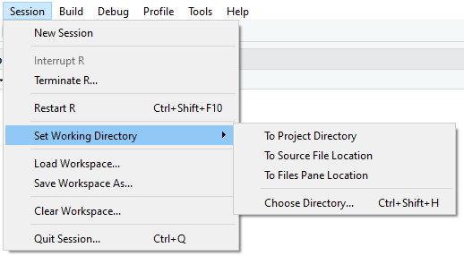
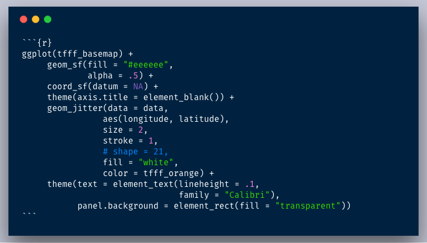
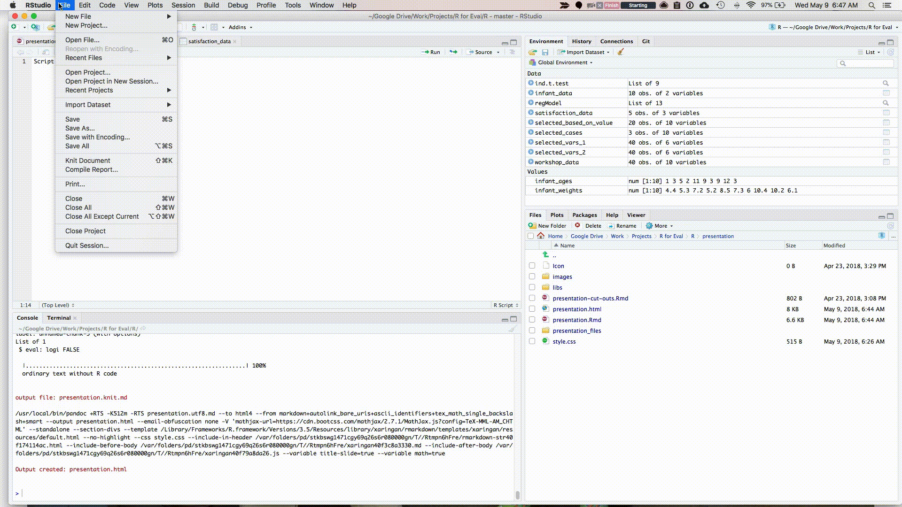
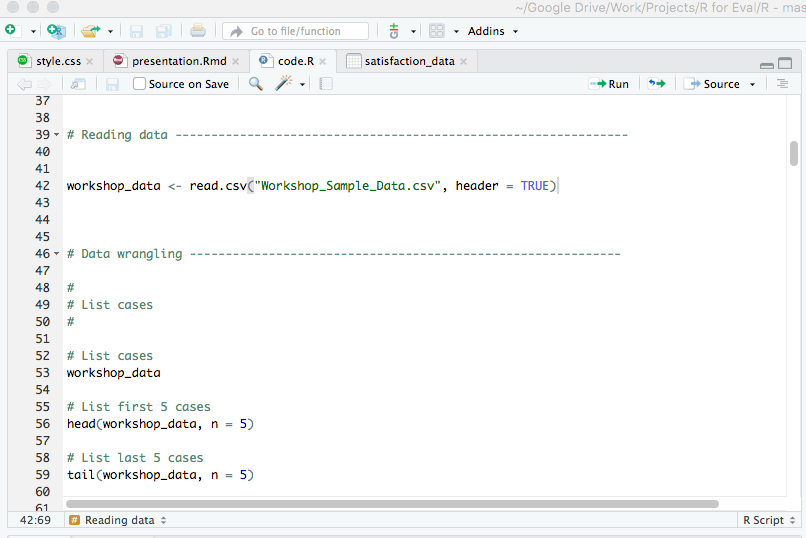

## [Working Directory]{style="color:red;"} {background-image="images/wdr.png"}

------------------------------------------------------------------------

## Working Directory

::: incremental
-   The working directory in R is **the folder where we are working**.

-   **Store** files or **load** them

-   **R Objects are saved**
:::

## Know the Working Directory

. . .

To check the directory of a R session, use the function `getwd()`

. . .

```{r, echo=TRUE, fig.height=4, fig.width=4,fig.align='center'}
#| echo: true
#| eval: true
#| code-overflow: scroll
#| code-fold: true
#| code-summary: "The Code"
#| output-location: fragment
#Find the path of the working directory
getwd()


```

## Setting the Working Directory

. . .

**setwd() function**

. . .

To change the working directory, we use `setwd()` function

. . .

We must specify the path of new working directory folder

. . .

```{r, echo=TRUE, fig.height=4, fig.width=4,fig.align='center'}
#| echo: true
#| eval: false
#| code-overflow: scroll
#| code-fold: true
#| code-summary: "The Code"
#| output-location: fragment
#To set new the working directory

 setwd ("E:/pen/New folder (2)/Rclass_2025")


```

## RStudio-GUI

**Change working directory in RStudio**

::: incremental
-   In order to create a new directory go to `Session` $\rightarrow$ `Set Working Directory`

-   Select the option there
:::

::: r-stack
{.fragment width="450" height="300"}
:::

## Your TURN

::: incremental
-   Check the working directory

-   Change the working directory
:::

## [Projects]{style="color:red;"} {background-image="images/projects.jpeg"}

## Projects {.scrollable}

::: incremental
-   Projects allow you to keep a collection of files all together, including:

    -   R scripts

    -   RMarkdown files (more on this later)

    -   Data files

    -   And much more!

-   very useful to organize our scripts in folders

-   when opening a project, it will contain all the files corresponding to it. Also, the project folder will be set as the working directory

-   sets the working directory and makes relative path
:::

## Creating a Project



## [Files in R]{style="color:red;"} {background-image="images/files.jpg"}

## Files in R {.smaller}

. . .

#### File Types

. . .

There are **two main file types** that you'll work with

. . .

::: columns
::: {.column width="50%"}
::: fragment
**R scripts (.R)**
:::

::: fragment
Text is assumed to be executable R code unless you comment it (more on this soon)
:::

::: fragment
```{r,message=FALSE}
#| echo: true
#| eval: FALSE
#| code-overflow: scroll
#| code-fold: true
#| code-summary: "The Code"
#| output-location: fragment

# This is a comment

data <- read_csv("train.csv")

```
:::
:::

::: {.column width="50%"}
::: fragment
**RMarkdown files (.Rmd)**
:::

::: fragment
Text is assumed to be text unless you put it in a code chunk (more on this Later)
:::

::: fragment

:::
:::
:::

## R script? {.scrollable}

::: incremental
-   While you can run/execute **r code** using `R console` with ease.

-   It is time consuming.

-   Each time you have to re-enter a command to execute it.

-   Be calm, we have solution that is `R scripts`

-   A script is simply a text file containing a set of commands and comments. The script can be saved and used later to re-execute the saved commands. The script can also be edited so you can execute a modified version of the commands.
:::

------------------------------------------------------------------------

## Creating R Script {.scrollable}

Create new script file: File -\> New File -\> R Script

. . .



-   [For detailed instructions, see HERE!](http://mercury.webster.edu/aleshunas/R_learning_infrastructure/R%20scripts.html)

## R Script



## R Script {.scrollable}

#### How to execute the Code

-   To execute the code: control + enter on Windows, command + enter on Mac keystrokes or use Run button

::: r-stack
{.fragment width="650" height="350"}
:::

## R Script

-   Note that you don't have to highlight code. You can just hit run anywhere on line to run code.

### Comments

-   Do them for others, and for your future self.

```{r eval = F}

# This is a comment

#head(data, n = 5)

```

## [Packages]{style="color:blue;"} {background-image="images/pack.jpg"}

## Packages

::: incremental
-   What is R package?

-   An R package is a collection of R functions, data, and compiled code bundled together

-   As of Today, there are **21924** [Packages](https://cran.r-project.org/web/packages/)

-   Packages relevant to specific area can be viewed at [CRANTASKVIEW](https://cran.r-project.org/web/views/)

-   How to use a package?

    -   Install a package using `install.packages("package name")`
    -   Loading/attaching a package in current session use `library(package name)`
:::

## Packages

::: incremental
-   `data.table`
-   `readxl`
:::

## Your TURN

::: incremental
-   Create a **Project**

-   Create a **script file**

-   Install **TWO packages using script file**
:::

## [Have patience]{style="color:red;"} {background-image="images/p.jpg"}

::: column-margin
::: footer
[THANKS]{style="color:blue;.aside"}
:::
:::
