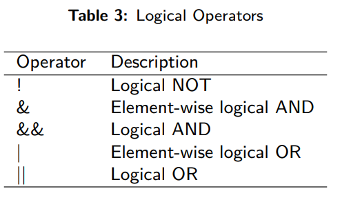
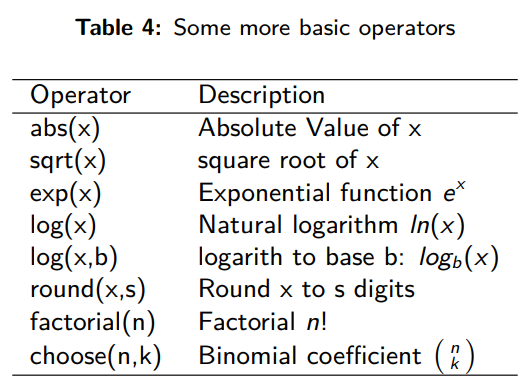

## Lets learn 4m History

::: incremental
-   Open R Studio using R project(created before)

-   Create a R script file

-   save it(Use lecture number or date as name)

-   Do make comments in your script file

-   In the r script file/console, calculate $21+21$ , $7*6$ and $(0.3/4) × \sqrt(31360)$
:::

------------------------------------------------------------------------

## Solutions

```{r, echo=TRUE, fig.height=4, fig.width=4,fig.align='center'}
#| echo: true
#| eval: true
#| code-overflow: scroll
#| code-fold: true
#| code-summary: "The Code"
#| output-location: fragment

21+21

7*6

.3/4*sqrt(31360)


```

## Basic Operators

::: incremental
-   Basic Operators can be classified into four categories
    -   Arithmetic Operators
    -   Relational Operators
    -   Logical Operators
    -   Assignment Operators
:::

## Assignment Operator {#sec-assignment-operator .scrollable}

::: incremental
-   These operators are used to assign values to variables

-   The operators `<-`and `=` can be used most of the time interchangeably

-   The `<<-` operator is used for assigning to variables in the parent environments (more like global assignments)

-   right ward operators, however rarely used\
:::

. . .

| **Operator**     | **Descriptor**       |
|------------------|----------------------|
| `<-`, `<<-`, `=` | Leftward Assignemnt  |
| `->`, `->>`      | Rightward Assignment |

: Table: Assignment Operators

## Assignment Operator

### Example

```{r, echo=TRUE, fig.height=4, fig.width=4,fig.align='center'}
#| echo: true
#| eval: true
#| code-overflow: scroll
#| code-fold: false
#| code-summary: "The Code"
#| output-location: fragment

x <- 5
x
y = 9
y
10 -> b
b
M <<- 50
50 ->> N
M > N
msg <- "Hey, YOU people are SMART! & I mean it"
msg
```


## Arithmetic Operators

| Operators | Description                 |
|-----------|-----------------------------|
| `+`       | Addition                    |
| `-`       | Subtraction                 |
| `*`       | Multiplication              |
| `/`       | Division                    |
| `^`       | Exponential                 |
| `%%`      | Modulus(Remainder Division) |

: Table 2: Arithmatic Operators

## Arithmetic Operator

### Example

```{r, echo=TRUE, fig.height=4, fig.width=4,fig.align='center'}
#| echo: true
#| eval: true
#| code-overflow: scroll
#| code-fold: false
#| code-summary: "The Code"
#| output-location: fragment
##| code-line-numbers: "1|3|4"

X <- 5 # this is assignment operator, we discussed earlier
Y <- 16 # we have values of X and Y

X+Y
X-Y
X*Y
Y/X
Y%%X
Y^X
2^3
```

## Relational Operators

-   Relational operators are used to compare between values\

    | Operators | Description              |
    |-----------|--------------------------|
    | `<`       | Less than                |
    | `>`       | Greater than             |
    | `<=`      | Less than or equal to    |
    | `>=`      | Greater than or equal to |
    | `==`      | Equal to                 |
    | `!=`      | Not equal to             |

    : Table 3: Relational Operator

## Relational Operators

### Examples

```{r, echo=TRUE, fig.height=4, fig.width=4,fig.align='center'}
#| echo: true
#| eval: true
#| code-overflow: scroll
#| code-fold: false
#| code-summary: "The Code"
#| output-location: fragment
##| code-line-numbers: "1|3|4"

X <- 5 # this is assignment operator, we discussed earlier
Y <- 16 # we have values of X and Y
X<Y
X>Y
X<=5
Y>20
Y==16
Y!=X
```

## Logical Operators

-   Logical operators are used to carry out Boolean operations like AND, OR etc

-   Operators `&` and `|` perform element-wise operation producing result having length of the longer operand

-   But `&&` and `||` examines only the first element of the operands resulting into a single length logical vector

-   Zero is considered FALSE and non-zero numbers are taken as TRUE

## Logical Operators

{fig-align="center"}

## Logical operators

::: incremental
-    `&&`→(logical AND)

-   Compares two expressions and returns true if both evaluate to true.

-   Returns false only if both expressions are false.

    ::: incremental
    -   true `&&` false → Evaluates false because the second is false

    -   false `&&` true → Evaluates false because the first is false

    -   true `&&` true → Evaluates true because both are true

    -   false `&&` false → Evaluates false because both are false \
    :::
:::

## Logical Operators-Explanations

-    `||`→(logical OR)

-   Compares two expressions and returns true if one or both evaluate to true.

-   Returns false only if both expressions are false.

    -   true `||` false → Evaluates true because the first is true

    -   false `||` true → Evaluates true because the second is true

    -   true `||` true → Evaluates true because both are true

    -   false `||` false → Evaluates false because both are false \

## Logical Operators-Examples

```{r, echo=TRUE, fig.height=4, fig.width=4,fig.align='center'}
#| echo: true
#| eval: true
#| code-overflow: scroll
#| code-fold: false
#| code-summary: "The Code"
##| code-line-numbers: "1|2|3|4|5|6|7"

X <- c(TRUE, FALSE, 0,6)
Y <- c(FALSE,TRUE,FALSE,TRUE)
!X
X&Y
X|Y
a <- c(TRUE)
b <- c(FALSE)
a&&b
a||b
```

## Explore!

```{r}
age <- 16
if (!(age > 18)) {
  print("You are Too Young")
} else if(age > 18 && age <= 35) {
  print("Young Guy")
} else if(age == 36 || age <= 60) {
  print("You are Middle Age Person")
} else {
  print("You are too Old")
}
```


## Some more basic operators

{fig-align="center"}


## Your TURN


-   Add, subtract, multiply and divide your age with your friend's age
-   Use logical operators to compare your age with your friend's age
-   If the value of `x` in the last example is changed to 20, 40 and 66, what will be the results?


## [Have patience]{style="color:red;"} {background-image="images/p.jpg"}

::: column-margin
::: footer
[THANKS]{style="color:blue;.aside"}
:::
:::
